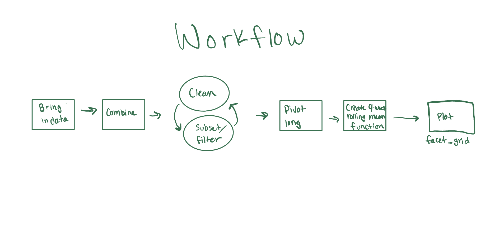

# Analyzing Nutrient Concentrations in streams of Bisley, Puerto Rico during 1986-1994

Author: Kylie Newcomer

## Data

Data is from “Effects of Hurricane Disturbance on Stream Water Concentrations and Fluxes in Eight Tropical Forest Watersheds of the Luquillo Experimental Forest, Puerto Rico.” and can be accessed at this link: https://doi.org/10.6073/pasta/f31349bebdc304f758718f4798d25458. This study examines the impacts of Hurricane Hugo on nutrient concentrations in streams throughout Puerto Rico. The raw data can also be found in the "**data**" folder. 

Data was subset to fit the parameters for Figure 1 of Schaefer et al 2000. 

## Analysis

I started this project by bringing in the data sets and combining them with the rbind() function. I began to clean up and filter the data to fit the parameters necessary for a 9-week rolling average. After that, I pivoted the data to a long format to create a "nutrients" column in order to run a a 9-week average function to the entire data set at one time. I then exported my cleaned data in to the "**output**" folder.

After cleaning the data, I created a function that arranged and grouped the data set and applied a slide_index function to find the 9-week rolling mean to the entire data set in one step. The rolling mean function was written in "rolling-mean-function.R", which can be found in the "**R**" folder.

## References

McDowell, W. and International Institute of Tropical Forestry(IITF), USDA Forest Service.. 2024. Chemistry of stream water from the Luquillo Mountains ver 4923064. Environmental Data Initiative. <https://doi.org/10.6073/pasta/f31349bebdc304f758718f4798d25458>

Schaefer, Douglas. A., William H. McDowell, Fredrick N. Scatena, and Clyde E. Asbury. 2000. “Effects of Hurricane Disturbance on Stream Water Concentrations and Fluxes in Eight Tropical Forest Watersheds of the Luquillo Experimental Forest, Puerto Rico.” Journal of Tropical Ecology 16 (2): 189–207. <https://doi.org/10.1017/s0266467400001358>.
